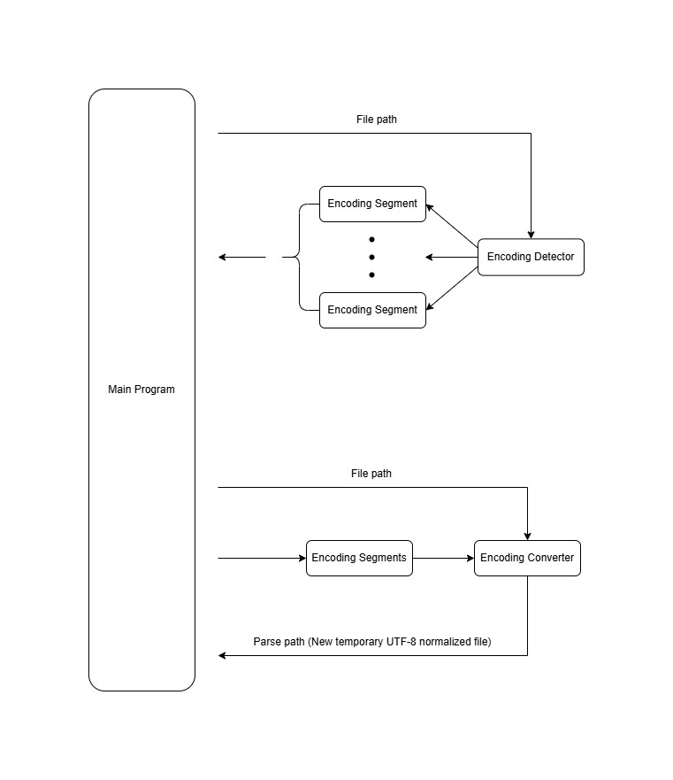
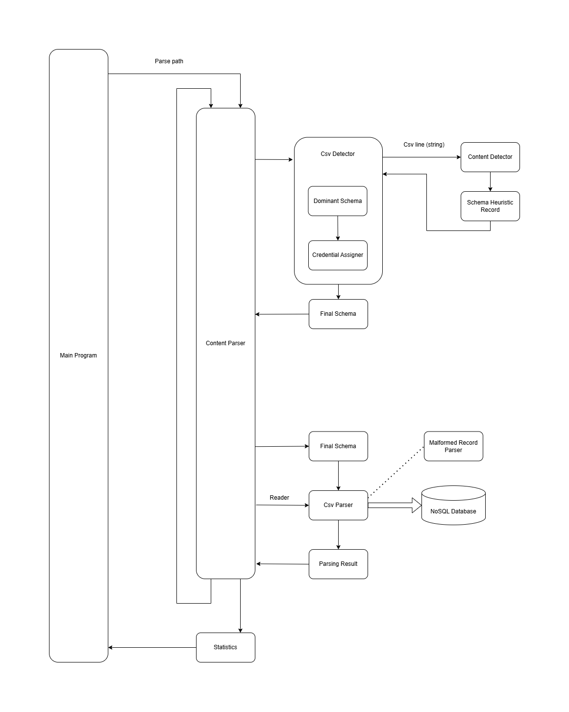
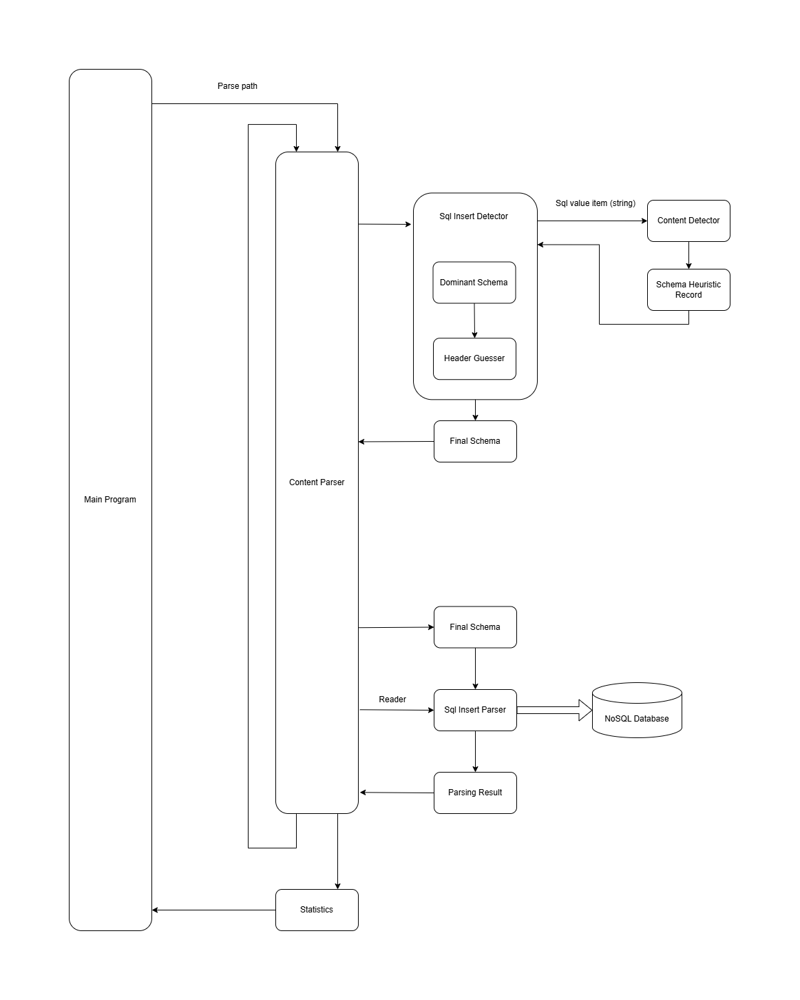

# LeakChecker Changelog

Author: Adam Havlík

## Table of Contents

- [Encoding](#encoding)
  - [Encoding Detection](#encoding-detection)
  - [Encoding Conversion](#encoding-conversion)
- [Format](#format)
  - [Format Detection](#format-detection)
- [Content](#content)
  - [Content Detection](#content-detection)
  - [Content Processing](#content-processing)
- [Utilities](#utilities)
- [Tests](#tests)
  - [Unit Tests](#unit-tests)
  - [Module Tests](#module-tests)
  - [Integration Tests](#integration-tests)
- [Diagrams](#diagrams)
  - [Data Flow](#data-flow)
- [TODOs](#todos)
- [Notes](#notes)

## Encoding

### Encoding Detection

- `27.5.2025` - EncodingMap  
  Map between pythons [charset-normalizer](https://pypi.org/project/charset-normalizer/) and .NET supported encodings been created and verified to [IANA](https://www.iana.org/assignments/character-sets/character-sets.xhtml), [Learn.Microsoft](https://learn.microsoft.com/en-us/dotnet/fundamentals/runtime-libraries/system-text-encoding), Wikipedia...
- `17.6.2025` - Encoding detection convert to .NET NuGet [UtfUnknown](https://github.com/CharsetDetector/UTF-unknown)  
  Due to performance issue with pythons charset-normalizer.  
  [NOTE] UtfUnknown can read stream and is pure C# tool based on Mozilla’s Universal Charset Detector used in Firefox. According to some officials charset-normalizer is more accurate, but I find it slower and have big performance issue in my use-case because it loads all file to a memory.
- `30.7.2025` - Encoding detection done precisely  
  Detection of concatenated files with various encodings and its segments.

### Encoding Conversion

- `3.10.2025` - Encoding Conversion  
  EncodingConverter converting file to UTF-8 in stream according to given EncodingSegments

## Format

### Delimiter Detection

- `20.8.2025` - [Python CSV sniffer](https://docs.python.org/3/library/csv.html#csv.Sniffer)  
  Smaller chunks 1024 B showed better results than larger 10_000_000 B (10MB). This can be linked only to the tested sample. Cant parse files where lot of attributes are missing as Facebook leak.
- `14.10.2025` - DelimiterDetector initial
- `29.10.2025` - DelimiterDetector accuracy improvement and code simplification  
  [NOTE] JDs solution have a success rate of 9/12 tested files. Current have full 12/12 but cant handle concatenated formats.

### Format Detection

- `21.9.2025` - HeuristicAnalyzer  
  Heuristic analyzer created with some helper methods. First shot of Pattern or Schema dramatically boost performance by decade or two.
- `29.9.2025` - SqlInsertDetector  
  Read and detect predefined number (31) of Sql Insert records, and return back heuristic schema.
- `9.10.2025` - CsvFileDetector  
  Read and detect predefined number (103) of lines, and return back heuristic schema.
- `3.11.2025` - HeaderGuesser  
  Guessing predefined and hardcoded values and try to match it on ItemEnum
- `18.11.2025` - CredentialAssigner  
  Assigning username to only first position if is detected as "Other" and password on second undetected position which can be higher than first index. Similar as [/etc/shadow](https://www.cyberciti.biz/faq/understanding-etcshadow-file/) 
- `20.12.2025` - SchemaHeuristic length normalization  
  Set final schema length to most frequent length based on delimiters count per each line. Cut in case it computed longer, fill with ItemEnum.Other if computed shorter than normalized length.
- `30.1.2026` - ExcelDetector  
  Initial of schema detection across Excel sheets in one forward sequential file scan using [ExcelDataParser](https://github.com/ExcelDataReader/ExcelDataReader) returning all schemas for all sheets.

## Content

### Content Detection

- `15.7.2025` - Pythons FastAPI  
  Created as localhost service for easy integration of AI recognition models.
- `15.7.2025` - Named Entity Recognition model  
  [Microsoft Presidio](https://microsoft.github.io/presidio/) (Regex + NER) base configuration and model was tested on raw lines with unsatisfied results as NER recognizer due to large variety of data without context, cant handle as NLP.
- `16.7.2025` - Named Entity Recognition model  
  [Microsoft Presidio](https://microsoft.github.io/presidio/) tested as orchestrator with [obi/deid_roberta_i2b2](https://huggingface.co/obi/deid_roberta_i2b2), [spacy/en_core_web_lg](https://huggingface.co/spacy/en_core_web_lg) and [s2w-ai/CyBERTuned-SecurityLLM](https://huggingface.co/s2w-ai/CyBERTuned-SecurityLLM) on raw lines with unsatisfied results as NER recognizer with same reason.
- `17.7.2025` - Zero-shot model  
  [facebook/bart-large-mnli](https://huggingface.co/facebook/bart-large-mnli) was tested with almost good results. There is need to know delimiters in data, process it by commonly know regexes and at the end tokens which are still unknown send to Zero-shot recognizer for categorization.  
  [NOTE] This model is 10x faster on Nvidia 1650Ti than on Intel 10300H. There is need to reinstall python torch from CPU to GPU.
- `3.8.2025` - Content detections  
  - C# - [MailAddress.TryCreate()](https://learn.microsoft.com/en-us/dotnet/api/system.net.mail.mailaddress.trycreate?view=net-10.0) is good for now.
  - C# - [DateTime.TryParse()](https://learn.microsoft.com/en-us/dotnet/api/system.datetime.tryparse?view=net-10.0)  
    [NOTE] It cant parse 4/15/2018 12:00:00 AM from Facebook leak when delimiter is ":".
  - C# - [IPAddress.TryParse()](https://learn.microsoft.com/en-us/dotnet/api/system.net.ipaddress.tryparse?view=net-10.0) is good for now.  
    [NOTE] Cant parse ip with ports, can also parse decimal or hexadecimal format. For example US phone number in local format 4085551234 can be misinterpreted as 243.132.144.130. Additional validation for IPv4:
    ```csharp
    if (ipAddress.AddressFamily == AddressFamily.InterNetwork &&
        token.Count(ch => ch == '.') == 3)
    ```
    IPv6 was not properly tested. This can also parse IpV4 mapped to IpV6 - 192.168.1.1 = ::ffff:192.168.1.1 .
 = ::ffff:c0a8:0101.
  - NuGet - [PhoneNumbers](https://github.com/google/libphonenumber) by Google  
    [NOTE] It can do also optional localization. It cant process local number formats like 055 234 5678 from the United Arab Emirates.
- `4.8.2025` - Hash identification
  - Hash Identification applications were manually tested with dataset from [Hashcat Examples](https://hashcat.net/wiki/doku.php?id=example_hashes).
  - [www.hashes.com](https://hashes.com/en/tools/hash_identifier) - Hash Identifier do proper validation and return most successful results ordered by its popularity, have demo its web application with well documented [api](https://hashes.com/en/docs). Chosen solution.  
    [NOTE] It can misinterpret 2), 5)... as Base64 encoded text of plaintext ''. Additional validation:
    ```csharp
    if (Base64.IsValid(hash))
    ```
  - [HAITI](https://github.com/noraj/haiti) - Wide scale of supported hash types (600+) but it do not validation, match almost everything including mobile numbers, don't have a demo.
  - [CyberChef](https://github.com/gchq/CyberChef) - Do validation, have demo, but not support hashes with salt.
  - [Name-That-Hash](https://github.com/bee-san/Name-That-Hash) - Wide scale of supported hash types (300+), have demo, do some validation but not 100% correct, most unknown hashes "fallback" to BigCrypt hash type.
  - [hash-identifier](https://github.com/cadesalaberry/hash-identifier) - Deprecated, have demo. Last update is from 2015
  - [hashID](https://github.com/psypanda/hashID) - Deprecated, last update is from 2015
  - [dcode.fr/hash-identifier](https://www.dcode.fr/hash-identifier) - Good in some cases but don't have public API.
  - C# - [Base64.IsValid](https://learn.microsoft.com/en-us/dotnet/api/system.buffers.text.base64.isvalid?view=net-10.0) is good, but it can mismatch some string for example hl251986 as valid Base64.
  - [NOTE] - Other solutions are deprecated, not support salted values or support only few hash types
- `18.8.2025` - Named Entity Recognition of Name, Location and Organization  
  - [Microsoft Presidio](https://microsoft.github.io/presidio/) with [flair/ner-english-large](https://huggingface.co/flair/ner-english-large) model integrated after google close issue with sentencepiece used by flair.
- `11.9.2025` - Automated recognition from text where item may contain delimiter 
  - NuGet - [Microsoft.Recognizers.Text.DateTime](https://github.com/microsoft/Recognizers-Text) integrated for recognition of wide scale of Timestamps in text and conversion to C# DateTime format.  
    [NOTE] It can detect and convert 4/15/2018 12:00:00 AM from Facebook leak and also natural language like first of October 2018 15:32:18. It also detects a time range what we don't want to.
  - NuGet - [Microsoft.Recognizers.Text.Sequence](https://github.com/microsoft/Recognizers-Text) for recognition and conversion to C# structures  
    - Email + [MailAddress.TryCreate()](https://learn.microsoft.com/en-us/dotnet/api/system.net.mail.mailaddress.trycreate?view=net-10.0) for extra validation
    - Guid + TryParse
    - Url + TryParse
    - IpAddress - Not added because it cant recognize ports.
- `13.9.2025` - Validation of Gender and Marital Status  
  - Validation done with some hardcoded values
- `22.9.2025` - MAC Address parser  
  - C# - [PhysicalAddress.TryParse()](https://learn.microsoft.com/en-us/dotnet/api/system.net.networkinformation.physicaladdress.tryparse?view=net-10.0#system-net-networkinformation-physicaladdress-tryparse(system-string-system-net-networkinformation-physicaladdress@))    
    [NOTE] SHA1 hash 08137e51edc9d3bf54fd051e3d91bd471c93a240 can be misinterpreted as Mac address. Additional validation:
    ```csharp
    if (normalizedToken.Length == 12 && normalizedToken.All(char.IsAsciiHexDigit))
    if (mac.GetAddressBytes().Length == 6)
    ```
- `28.9.2025` - Timestamp parser
  - Unix seconds since epoch (1970-01-01 UTC) - 1284982477 is 2010-09-20 18:34:37 UTC
  - Unix milliseconds since epoch (1970-01-01 UTC)
  - Windows FileTime - 100-nanosecond intervals since 1601-01-01 00:00:00 UTC
  - .Net ticks - 100-nanoseconds = 1 tic, tics since 0001-01-01 00:00:00 UTC
  - Excel serial date - days since 1899-12-30  
  [NOTE] As it could be almost every bigger number. Additional validation and Excel serials might be removed in future according to possible mismatch with one of IDs. Also, UnixSeconds but that's quite common in logs.
  ```csharp
  // Date of birth can be 100 years ago, games with big impact as Counter Strike and Mario cart were released after 2000
  DateTime minDate = new DateTime(2000, 1, 1);
  DateTime maxDate = DateTime.UtcNow.AddYears(10);

  bool IsInRange(DateTime dt) =>
    dt >= minDate && dt <= maxDate;
  ```
  Then valid numeric ranges (approx as of 2025-09-28)
  ```bash
  Unix seconds: 946684800 .. 1759075200
  Unix ms: 946684800000 .. 1759075200000
  FILETIME: 125911584000000000 .. 133805000000000000
  .NET ticks: 630822816000000000 .. 638644800000000000
  Excel serials: 36526 .. 45849
  ```
  
- `1.10.2025` - Password detection [SAP/password-model](https://huggingface.co/SAP/password-model)  
  Tested with no relevant results.
- `2.10.2025` - Username and Password detection opportunities 
  - Username detection
    - [C-Ilyas/Numrah_nsfw_username_classifier](https://huggingface.co/C-Ilyas/Numrah_nsfw_username_classifier) tested with no relevant results.
  - Username and Password detection opportunities
  - [deepaksiloka/PII-Detection](https://huggingface.co/deepaksiloka/PII-Detection) tested with very poor results.
  - [bigcode/starpii](https://huggingface.co/bigcode/starpii) tested with very poor results.
- `5.10.2025` - Username and Password detection opportunities
  - [knowledgator/gliner-pii-large-v1.0](https://huggingface.co/knowledgator/gliner-pii-large-v1.0) tested with no relevant results.
  - [Microsoft Presidio](https://microsoft.github.io/presidio/) tested as orchestrator of previously used model and models from `2.10.2025` with no relevant results.  
  [NOTE] - Most models can recognize contextual data like "User login info: username: alice, password: p@ssW0rd123".  Pure credentials as content-free data are hard to recognize, detect and validate.
- `7.10.2025` - Password detection opportunities  
  [Levenshtein distance](https://en.wikipedia.org/wiki/Levenshtein_distance) tried on some possible passwords with not satisfied results. Need big data set for this and still can make a lot of mistakes. Another problem comes when items are sorted alphabetically and from beginning can continue sequence with items like "AAAA" or "0000"
- `27.10.2025` [IbanNet](https://github.com/skwasjer/IbanNet) - validation of some common formats
- `30.11.2025` Hash type recognition implemented with www.hashes.com mentioned `4.8.2025`

### Content Processing

- `30.9.2025` Sql Insert processor  
  SqlInsertProcessor added for processing Sql Insert records with given schema.
- `10.10.2025` Csv file processor  
  CsvFileProcessor added for processing Csv file lines with given schema.
- `19.12.2025` Malformed lines sequence check  
  Processors count sequence of lines with fields count different from expected. When reached the limit, then return back to recompute the schema.
- `31.1.2026` - ExcelParser  
  Initial of ExcelParser using [ExcelDataParser](https://github.com/ExcelDataReader/ExcelDataReader) which can read direct values of each cell in Excel row by row and column by column.

## Utilities

- `30.7.2025` - Added some logging tools to log processing details and statistics to log file.
- `6.8.2025` - Logging utilities improvement.
- `19.8.2025` - Detailed file processing logging added
- `13.9.2025` - Detailed execution logging added
- `19.9.2025` - StringExtension  
  Custom and performance trimming of quoted text `content`` / 'content' / "content" or SQL line (content),.
- `28.9.2025` - StreamReaderExtensions  
  Custom ReadLineWithEndingAsync return line with newline to measure of read bytes.
- `21.12.2025` Channel threading initial  
  To avoid context switching when parsing large amount of files.
- `29.1.2026` - FileHandler  
  Handling file accessibility, supported file type according its mime type detected by [Mime-Detective](https://github.com/MediatedCommunications/Mime-Detective), if its excel trying to open [ExcelDataParser](https://github.com/ExcelDataReader/ExcelDataReader), readability of converted encodings scanning for lines containing a '�' as unrecognized character.
- `1.3.2026` - All files collecting  
  Is done with Directory.EnumeratingFiles from specified directory path by tree traversal.
- `2.3.2026` - ArchiveExtractor  
  Used microsoft [RecursiveExtractor](https://github.com/microsoft/RecursiveExtractor) which is simple to use, based on popular SharpCompress, LTRData/DiscUtils and protecting against zip bombs and zip slips.
- `21.1.2026` - Use Host builder pattern and DI widely but still need tune
- `22.3.2026` - EncodingExtension
- `23.3.2026` - ArchiveDetector based on [Mime-Detective](https://github.com/MediatedCommunications/Mime-Detective) and file extensions

## Tests

### Unit tests

- `14.10.2025` - Content.Detection.ItemParsing add initial tests
- `15.10.2025` - Content.Detection.ItemRecognition add initial tests
- `3.11.2025` - Format.HeaderGuesser initial tests
- `1.12.2025` - HashParser initial tests
- `2.12.2025` - HashParser added tests
- `7.2.2026` - HashParser added tests
- `10.2.2026` - Format.CredentialAssigner tests
- `12.2.2026` - ContentParser format detection initial tests
- `13.2.2026` - Format.DelimiterDetection initial tests
- `21.2.2026` - Encodings.Detection tests
- `23.2.2026` - ServicesTests of availability of PythonNerService and [hashes.com](https://hashes.com/en/tools/hash_identifier)
- `23.2.2026` - ContentParser add mixed format tests

### Module tests

- `13.2.2026` - Format.SqlDetector initial tests
- `13.2.2026` - Format.CsvDetector initial tests
- `17.2.2026` - Format.ExcelDetector initial tests

### Integration tests

- `XX.10.2025` - Whole system tests

## Diagrams

### Data Flow


Picture: Encoding Detector of segments and Encoding Conversion to UTF-8


Picture: Csv Detector of format and Csv Parser of content


Picture: SQL Detector of format and SQL Parser of content

## Test Dataset

- 12 Files
- 8,21 Gb size
- 202 072 485 Lines
- 26 835 Malformed

- 202 017 719 Records
- 200 250 065 Emails
- 155 985 180 Passwords
- 15 342 865 Usernames
- 15 137 308 IPv4
- 1 382 019 Timestamps

## TODOs

- When hash detected at `[i]` and `[i+1]` is other try to concatenate with delimiter for salted hash detection.
- When row mismatch, parse it separately.
- Use DI to PythonNerServiceRecognizer
- Refactor tests, use DI and load proper config from DataParser.csproj
- Use DI in ContentParser. create factories for almost everything with interfaces to override the normal behavior
- Remove async from Execution logging chain
- Fix byte counting position tracking system
- Parse also `JSON`, `HTML` and `XML`
- Make something like TestBase class where will be registered EncProvider, created logger or set env variable.
- Make proper parallel ArchiveExtraction using batching technique.
- Replace StringExtension IsSqlInsert with ReaderExtension IsSqlInsert which will read predefined lines returns true/false and discard buffers
- When all is number then not bind `ItemEnum.Other`, else try to recompute without other as an `ItemEnum.Empty`, when full numbers, bind `ItemEnum.Id`
- Wait properly for python start. READY signal is sent earlier than running python API 
- Make `TestBase` with EncProvider(RegisterEnc) and projectDir and testDir paths
- Proper format detection of `AsciiTable` occur +-+ header -> is AsciiTableCandidate and on first 2 positions of delimiter results is somewhere delimiter "|" with simmillar probability. Or properly identify first 3 lines of the file but this need more attention. Maybe via reader which read first 3 lines and decide if it has `AsciiTable` header.
- Communication timeout for connection and request reply
- Parse also Sql REPLACE INTO
- `EncodingDetector` tests for mixed encodings, cant do properly for legacy encodings.
- Custom hash identification for truecrypt, veracrypt and other hashes in text form or common prefix 
- Test `TimestampParser` and parser for valid datetime range. What's the correct range?
- Detect Username and plaintext Password. CredentialCandidate???
- Decide how to enum localhost IpV4/IpV6
- Decide how to process a IpAddress ports
- Decide if IpAddress parsing of cross mapped addresses are feature or limitation. Can be done by [Microsoft.Recognizers.Text.Sequence](https://github.com/microsoft/Recognizers-Text) automated recognition as Email, Guid and Urls are.
- Location GPS coordinates [parser](https://github.com/Tronald/CoordinateSharp)
- NationalID and VAT [parsers](https://github.com/anghelvalentin/CountryValidator)
- Bank cards ???
- Detect other content.
- Do IPv6 validation which may be done by regex from [Vladimir Veselý - IPK2024-06-IPv6](https://moodle.vut.cz/pluginfile.php/823898/mod_folder/content/0/IPK2023-24L-09-IPv6.pdf)
  ```regexp
  `/^\s*((([0-9A-Fa-f]{1,4}:){7}(([0-9A-Fa-f]{1,4})|:))|(([0-9A-Fa-f]{1,4}:){6}(:|((25[0-5]|2[0-4]
  \d|[01]?\d{1,2})(\.(25[0-5]|2[0-4]\d|[01]?\d{1,2})){3})|(:[0-9A-Fa-f]{1,4})))|(([0-9A-Fa-f]
  {1,4}:){5}((:((25[0-5]|2[0-4]\d|[01]?\d{1,2})(\.(25[0-5]|2[0-4]\d|[01]?\d{1,2})){3})?)|((:[0-9A-Fa-f]
  {1,4}){1,2})))|(([0-9A-Fa-f]{1,4}:){4}(:[0-9A-Fa-f]{1,4}){0,1}((:((25[0-5]|2[0-4]\d|[01]?\d{1,2})(\.(25[0-5]
  |2[0-4]\d|[01]?\d{1,2})){3})?)|((:[0-9A-Fa-f]{1,4}){1,2})))|(([0-9A-Fa-f]{1,4}:){3}(:[0-9A-Fa-f]
  {1,4}){0,2}((:((25[0-5]|2[0-4]\d|[01]?\d{1,2})(\.(25[0-5]|2[0-4]\d|[01]?\d{1,2})){3})?)|((:[0-9A-Fa-f]
  {1,4}){1,2})))|(([0-9A-Fa-f]{1,4}:){2}(:[0-9A-Fa-f]{1,4}){0,3}((:((25[0-5]|2[0-4]\d|[01]?\d{1,2})(\.(25[0-5]
  |2[0-4]\d|[01]?\d{1,2})){3})?)|((:[0-9A-Fa-f]{1,4}){1,2})))|(([0-9A-Fa-f]{1,4}:)(:[0-9A-Fa-f]
  {1,4}){0,4}((:((25[0-5]|2[0-4]\d|[01]?\d{1,2})(\.(25[0-5]|2[0-4]\d|[01]?\d{1,2})){3})?)|((:[0-9A-Fa-f]
  {1,4}){1,2})))|(:(:[0-9A-Fa-f]{1,4}){0,5}((:((25[0-5]|2[0-4]\d|[01]?\d{1,2})(\.(25[0-5]|2[0-4]
  \d|[01]?\d{1,2})){3})?)|((:[0-9A-Fa-f]{1,4}){1,2})))|(((25[0-5]|2[0-4]\d|[01]?\d{1,2})(\.(25[0-5]|2[0-4]
  \d|[01]?\d{1,2})){3})))(%.+)?\s*$/`
  ```
  
- Test performance and profiling
- Nice to have separated ItemEnums `FirstName`, `LastName`, `DateOfBirth`, `Age`, `Nationality`, `EyeColor`, `HairColor`, `Height`, `Weight` but this can be matched only with `HeaderGuesser`

## Notes

- Relevant information about data breaches  
  - [leak-lookup.com](https://leak-lookup.com/breaches)
  - [haveibeenpwned.com](https://haveibeenpwned.com/PwnedWebsites)
- Data sample creation  
  - [tableconvert.com](https://tableconvert.com/)
- Tests  
  - More data = better accuracy
- Python hints
  - Create new virtual environment (.venv)
    ```shell
    python -m venv .venv
    ```
  - Activate .venv (windows)
    ```shell
    .venv\Scripts\activate.bat
    ```
  - Install required tools to .venv
    ```shell
    pip install -r requirements.txt
    ``` 
  - MongoDB
    - [MongoDB Shell](https://www.mongodb.com/try/download/shell)
    - [MongoDB Server](https://www.mongodb.com/try/download/community)
    - Run MongoDB locally
      ```bash
      .\mongod.exe --dbpath "..\..\data"
      ```
    - Search in DB
      ```bash
      db.users.find({ Username: { $regex: "^MyUsername234$", $options: "i" } })
      ```